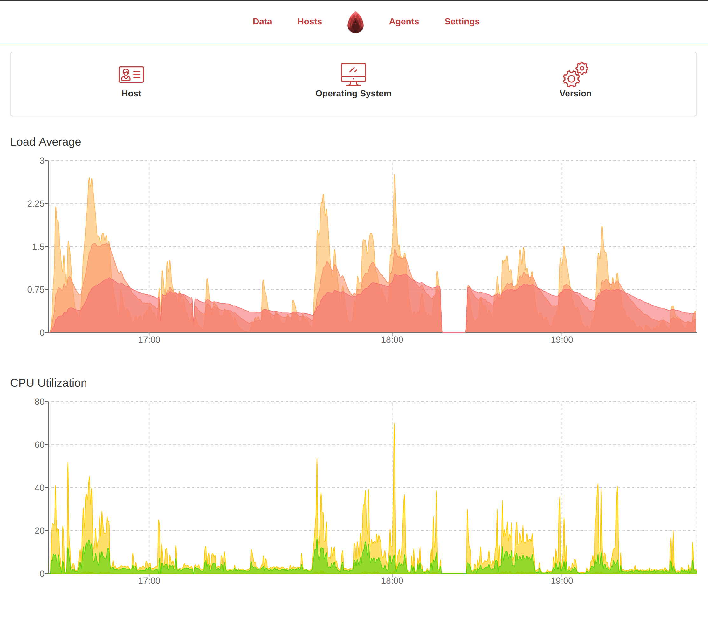

# Garnet

Intuitive and lightweight static dashboard for visualising time series stored in [infosetDB](https://github.com/PalisadoesFoundation/infoset-ng)



## Install
```bash
λ git clone https://github.com/PalisadoesFoundation/garnet
λ cd garnet
λ yarn
λ npm start 
```

## Building for Production

```bash
λ cd garnet
λ npm run build
```
