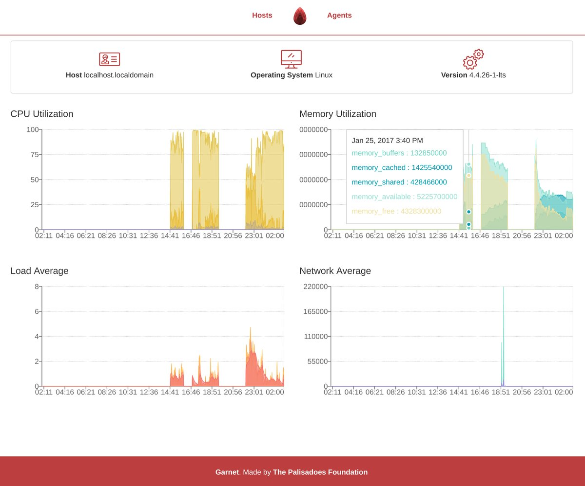

# Garnet
`garnet` is Python 3 based application that polls devices for performance data which can then
be viewed via a Web Dashboard.

The latest documentation can be found at: http://garnet.readthedocs.io/en/latest/
